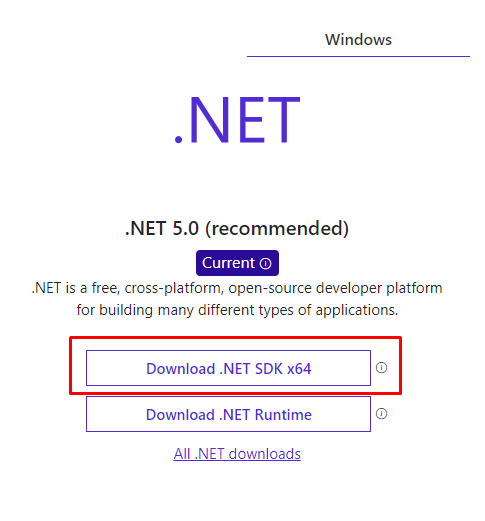

# Luxoft Test Task

Simple app with data producer and data consumer with connect by MQTT protocol.

## Project structure

1. DataConsumer: WPF project whitch get data from MQTT broker
2. DataProducer: Console app whitch read data from xlsx file and send it by mqtt protocol to broker
3. Common: Library whitch contains publish, subscribe and read interface
4. Test: A project with tests

## Installation

Instal Docker from [docker] for run MQTT Broker

Install last .NET SDK from [dotnet] 



#### Building

Run the following commands from the folder with the docker-compose file:
##### For create environment for RabbitMQ:
```sh
docker-compose up
```
##### For enable MQTT plugin in RabbitMQ:
```sh
docker exec -it rabbitmq bin/bash
rabbitmq-plugins enable rabbitmq_mqtt
rabbitmq-plugins enable rabbitmq_web_mqtt
```
Exit from container command line and restart docker by command:
```sh
docker-compose restart
```
To open a project in visual studio use the solution in the DataProducerConsumer folder. Then run the projects from VisualStudio.  
OR  
From folder **lux-test-task\DataProducer\DataProducer\DataProducer** execute command:
```sh
dotnet run
```
And from folder **lux-test-task\DataConsumer\DataConsumer\DataConsumer** execute command:
```sh
dotnet run
```

   [dotnet]: <https://dotnet.microsoft.com/download>
   [docker]: <https://www.docker.com/products/docker-desktop>
